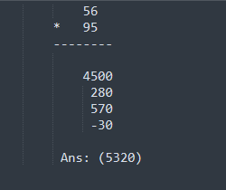

# Om's Method Of Multiplication or BreakDown Method.

1. Multiply the first digit of both numbers here it is, 5 * 9 = 45 add two zero.  
-> **4500**  
2. Multiply the number 56 and second digit of second multiplier i.e 5  
-> **56 * 5 = 280**
3. Multiply 95 and second digit of first multiplier i.e 6   
-> **95 * 6 = 570**
4. Add all the answers you got.  
-> **5350**
5. Multiply the second digit of both numbers i.e 6 * 5 and subtract the resultant number  
-> **-30**
 

***Ans: 5320***
 

> There are two benefits of this method let's start with first one.  
> The pattern.

I would be uploading few images and texts which shows how this method acts as a pattern for finding next number or it's factors, relationship between those numbers and the mystery of using subtraction and the subtraction resulting into yet another pattern for finding next number.
 

> The second benefit is not much great for average person, but if you can calcuate some numbers in head this method provides you with a speed boost.
